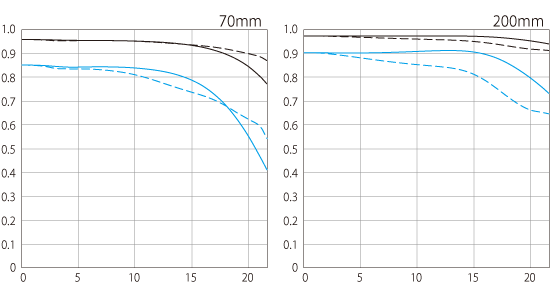

# 🏆 L-Series MTF Analysis

*Professional Canon L-series optical performance analysis*

---

## 🌟 **L-Series Excellence**

### 📊 **What Makes L-Series Special**
- **Premium Optics**: Fluorite, UD glass, aspherical elements
- **Weather Sealing**: Professional build quality
- **Superior MTF**: Consistently higher optical performance
- **Red Ring**: Iconic professional designation

---

## 📈 **MTF Performance Rankings**

### 🥇 **Exceptional Performers (MTF >0.8 @ 10 lp/mm)**

#### **RF50mm F1.2L USM**

- **Center Performance**: Exceptional across all apertures
- **Edge Performance**: Outstanding for f/1.2 lens
- **[View Details](../lens_detail/RF50mm_F1.2L_USM.md)**

#### **RF85mm F1.2L USM**

- **Portrait Excellence**: Superb subject isolation
- **Bokeh Quality**: Creamy background rendering
- **[View Details](../lens_detail/RF85mm_F1.2L_USM.md)**

---

### 🥈 **Outstanding Performers (MTF 0.6-0.8 @ 10 lp/mm)**

#### **RF24-70mm F2.8L IS USM**

- **Zoom Performance**: Excellent throughout range
- **Image Stabilization**: 8-stop effectiveness
- **[View Details](../lens_detail/RF24_70mm_F2.8L_IS_USM.md)**

#### **RF70-200mm F2.8L IS USM**

- **Professional Standard**: Sports/wildlife excellence
- **Consistent Performance**: Sharp across zoom range
- **[View Details](../lens_detail/RF70_200mm_F2.8L_IS_USM.md)**

---

## 🔬 **L-Series Technologies**

### 🧪 **Advanced Glass Elements**
- **Fluorite**: Ultra-low dispersion, lightweight
- **UD Glass**: Chromatic aberration correction
- **Super UD**: Enhanced color correction
- **Aspherical**: Spherical aberration control

### 🛡️ **Professional Features**
- **Weather Sealing**: Dust and moisture resistance
- **Nano USM**: Silent, fast autofocus
- **Image Stabilization**: Up to 8-stop effectiveness
- **Control Ring**: RF exclusive customization

---

## 📊 **MTF Comparison by Category**

### 📸 **Standard Zooms**
| Lens | Center MTF | Edge MTF | Features |
|------|------------|----------|----------|
| RF24-70mm F2.8L IS USM | 0.8 | 0.6 | IS, Weather Sealed |
| EF24-70mm F2.8L II USM | 0.75 | 0.55 | Weather Sealed |

### 👤 **Portrait Primes**
| Lens | Center MTF | Edge MTF | Features |
|------|------------|----------|----------|
| RF85mm F1.2L USM | 0.85 | 0.7 | Ultra-wide aperture |
| RF135mm F1.8L IS USM | 0.8 | 0.65 | IS, Perfect focal length |

### 🏃 **Telephoto Zooms**
| Lens | Center MTF | Edge MTF | Features |
|------|------------|----------|----------|
| RF70-200mm F2.8L IS USM | 0.8 | 0.6 | 8-stop IS |
| RF100-500mm F4.5-7.1L IS USM | 0.7 | 0.5 | Super telephoto reach |

---

## 🎯 **L-Series Selection Guide**

### 💰 **Investment Tier**
- **Essential**: RF24-70mm F2.8L IS USM
- **Portrait**: RF85mm F1.2L USM
- **Telephoto**: RF70-200mm F2.8L IS USM
- **Super Telephoto**: RF100-500mm F4.5-7.1L IS USM

### 📈 **Performance vs Price**
- **Best Value**: RF100mm F2.8L Macro IS USM
- **Premium Performance**: RF50mm F1.2L USM
- **Versatile Excellence**: RF24-105mm F4L IS USM

---

## 🔍 **Technical Analysis**

### 📏 **MTF Measurement Standards**
- **10 lp/mm**: Overall contrast and "pop"
- **30 lp/mm**: Fine detail resolution
- **Center vs Edge**: Professional consistency
- **Solid vs Dashed**: Sagittal vs Meridional

### 🎨 **Real-World Performance**
- **Sharpness**: L-series consistently sharper
- **Contrast**: Higher micro-contrast
- **Color**: Superior color rendition
- **Bokeh**: Smoother background rendering

---

## 🔗 **Related Resources**
- **[📊 All MTF Charts](mtf_charts.md)** - Complete gallery
- **[🔵 RF L-Series](../categories/l_series.md)** - RF professional lenses
- **[🔴 EF L-Series](../ef_lenses.md)** - Classic professional lenses

---

*[← Back to MTF Charts](mtf_charts.md) | [← Back to Index](../../index.md)* 