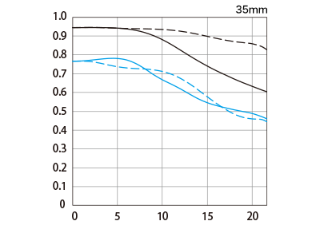

# 📊 MTF Charts Gallery - Visual Optical Performance

*Browse and compare Canon lens optical performance charts*

---

## 🎯 **Gallery Overview**

### 📈 **MTF Chart Collection**
- **Total MTF Charts**: 67 available
- **RF Lenses**: 42 charts
- **EF Lenses**: 13 charts
- **Other**: 12 charts

### 🔍 **How to Read MTF Charts**
- **X-axis**: Distance from center (mm)
- **Y-axis**: Contrast (0-1.0)
- **Higher lines** = Better performance
- **Solid lines** = Sagittal
- **Dashed lines** = Meridional

---

## 🔵 **RF Lens MTF Charts**

### 🏆 **Professional RF Lenses**

#### 📸 **RF24-70mm F2.8L IS USM**
*Professional standard zoom with excellent MTF performance*

**[📊 View Details](../lens_detail/RF24_70mm_F2.8L_IS_USM.md)**

---

#### 👤 **RF85mm F1.2L USM**
*Ultimate portrait prime with f/1.2 ultra-wide aperture*

**[📊 View Details](../lens_detail/RF85mm_F1.2L_USM.md)**

---

#### 🌄 **RF14-35mm F4L IS USM**
*Ultra-wide zoom with consistent performance*

**[📊 View Details](../lens_detail/RF14_35mm_F4_L_IS_USM.md)**

---

#### 🏃 **RF70-200mm F2.8L IS USM**
*Professional telephoto zoom excellence*

**[📊 View Details](../lens_detail/RF70_200mm_F2.8L_IS_USM.md)**

---

### 🌸 **Macro RF Lenses**

#### 🔍 **RF100mm F2.8L Macro IS USM**
*Professional macro with 1:1 magnification*

**[📊 View Details](../lens_detail/RF100mm_F2.8L_MACRO_IS_USM.md)**

---

#### 🌺 **RF35mm F1.8 Macro IS STM**
*Wide-angle macro with versatile use*

**[📊 View Details](../lens_detail/RF35mm_F1.8_MACRO_IS_STM.md)**

---

### 📷 **Telephoto RF Lenses**

#### 🦅 **RF100-500mm F4.5-7.1L IS USM**
*Versatile super telephoto zoom*

**[📊 View Details](../lens_detail/RF100_500mm_F4.5_7.1L_IS_USM.md)**

---

#### 🎯 **RF600mm F4L IS USM**
*Professional super telephoto prime*

**[📊 View Details](../lens_detail/RF600mm_F4L_IS_USM.md)**

---

## 🔴 **EF Lens MTF Charts**

### 🏆 **Professional EF Lenses**

#### 📸 **EF24-70mm F2.8L II USM**
*Classic professional standard zoom*

**[📊 View Details](../lens_detail/EF24_70mm_F2.8L_II_USM.md)**

---

#### 📷 **EF70-200mm F2.8L IS III USM**
*Legendary telephoto zoom*

**[📊 View Details](../lens_detail/EF70_200mm_F2.8L_IS_III_USM.md)**

---

#### 🌸 **EF100mm F2.8L Macro IS USM**
*Professional macro excellence*

**[📊 View Details](../lens_detail/EF100mm_F2.8Lマクロ_IS_USM.md)**

---

## 📊 **MTF Performance Analysis**

### 🎯 **Performance Categories**

| Performance Level | MTF @ 30 lp/mm | MTF @ 10 lp/mm | Example Lenses |
|------------------|-----------------|-----------------|----------------|
| **Excellent** | >0.6 | >0.8 | RF50mm F1.2L, RF85mm F1.2L |
| **Very Good** | 0.4-0.6 | 0.6-0.8 | RF24-70mm F2.8L, RF70-200mm F2.8L |
| **Good** | 0.3-0.4 | 0.5-0.6 | RF24-105mm F4L, RF100-400mm F5.6-8 |
| **Fair** | 0.2-0.3 | 0.4-0.5 | RF800mm F11, RF600mm F11 |

### 🔍 **Key MTF Indicators**

#### 📏 **Spatial Frequencies**
- **10 lp/mm**: Overall contrast and "pop"
- **30 lp/mm**: Fine detail resolution
- **Higher frequency**: Better fine detail

#### 📐 **Line Types**
- **Solid Lines**: Sagittal (radial) performance
- **Dashed Lines**: Meridional (tangential) performance
- **Closer lines**: Better balance

---

## 🎨 **Visual Comparison Tools**

### 📊 **Side-by-Side Comparison**
- **[Compare RF vs EF](rf_vs_ef_comparison.md)** - Mount comparison
- **[L-Series Analysis](l_series_mtf.md)** - Premium performance
- **[Macro Lens MTF](macro_mtf_comparison.md)** - Close-up specialists

### 🔍 **Interactive Tools**
- **[Enhanced MTF Viewer](../../canon_enhanced_mtf_viewer.html)** - Interactive browser
- **[MTF Calculator](mtf_calculator.md)** - Performance analysis
- **[Lens Selector](../lens_finder.md)** - Find by performance

---

## 📚 **Educational Resources**

### 🎓 **Understanding MTF**
- **[MTF Basics](../education/understanding_mtf.md)** - Technical explanation
- **[Reading MTF Charts](../education/mtf_interpretation.md)** - Practical guide
- **[MTF vs Real World](../education/mtf_real_world.md)** - Practical implications

### 🔬 **Advanced Analysis**
- **[MTF Limitations](../education/mtf_limitations.md)** - What MTF doesn't show
- **[Bokeh vs MTF](../education/bokeh_vs_mtf.md)** - Aesthetic considerations
- **[MTF Testing Methods](../education/mtf_testing.md)** - How it's measured

---

## 🔗 **External MTF Resources**

### 📊 **Professional Analysis**
- **[LensRentals Optical Bench](https://www.lensrentals.com/blog/category/optical-bench/)** - Independent testing
- **[DXOMark Lens Tests](https://www.dxomark.com/category/lens-reviews/)** - Standardized testing
- **[Canon White Papers](https://www.canon.com/en/technology/lens-technology)** - Technical documentation

### 🎯 **Community Resources**
- **[Photography Forums](https://www.dpreview.com/forums/thread/4485464)** - MTF discussions
- **[YouTube Channels](https://www.youtube.com/results?search_query=MTF+chart+explanation)** - Video explanations
- **[Blog Articles](https://blog.lensrentals.com/tag/mtf/)** - Technical insights

---

*[← Back to Index](../../index.md) | [← Back to Mobile Gallery](../mobile_gallery.md)* 