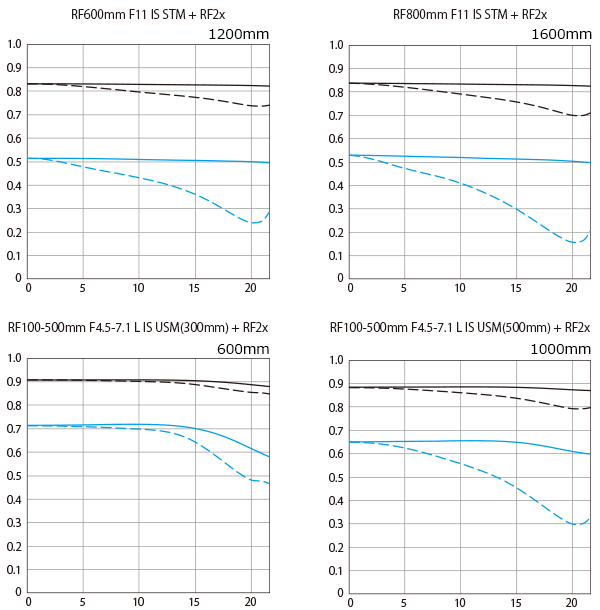
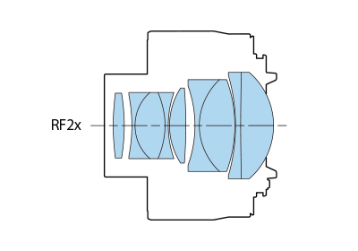

# 📷 EXTENDER RF2x

*Detailed specifications and optical analysis*

---

## 📊 **Lens Overview**

### 🔍 **Basic Information**
- **Name**: EXTENDER RF2x
- **Mount**: RF
- **MTF Chart**: ✅ Available
- **Construction**: ✅ Available
- **Specification Images**: 5 images

### 🌐 **Source Information**
- **Canon Japan URL**: [View Official Page](https://personal.canon.jp/product/camera/rf/extender-rf2/spec)
- **Data Collection**: Automated web scraping
- **Last Updated**: January 2025

---

## 🔧 **Technical Specifications**

### 📏 **Detailed Specifications**
- **対応レンズ**: 焦点距離／開放F値
- **RF400mm F2.8 L IS USM**: 800mm／F5.6
- **RF600mm F4 L IS USM**: 1,200mm／F8
- **RF600mm F11 IS STM**: 1,200mm／F22
- **RF800mm F5.6 L IS USM**: 1,600mm／F11
- **RF800mm F11 IS STM**: 1,600mm／F22
- **RF1200mm F8 L IS USM**: 2,400mm／F16
- **RF70-200mm F2.8 L IS USM Z**: 140-400mm／F5.6
- **RF100-300mm F2.8 L IS USM**: 200-600mm／F5.6
- **RF100-400mm F5.6-8 IS USM**: 200-800mm／F11-F16
- **RF100-500mm F4.5-7.1 L IS USM※**: 600-1,000mm／F11-14
- **RF200-800mm F6.3-9 IS USM**: 400-1,600mm／F13-18

---

## 📊 **Optical Performance**

### 📈 **MTF Chart Analysis**

- **MTF Chart**: Available for detailed analysis
- **Resolution**: High-resolution PNG format
- **Analysis**: Shows optical performance at different apertures
- **Comparison**: Can be compared with other lenses

### 🔍 **Lens Construction**

- **Construction Diagram**: Available showing optical elements
- **Element Layout**: Visual representation of lens groups
- **Optical Design**: Shows lens element arrangement
- **Engineering**: Illustrates optical complexity

---

## 🎯 **Lens Classification**

### 📝 **Category Analysis**
- **Lens Type**: Teleconverter
- **Maximum Aperture**: f/2.0 (Constant)

---

## 📱 **Quick Actions**

### 🔧 **Tools & Viewers**
- **[📊 View in Enhanced Viewer](../../canon_enhanced_mtf_viewer.html)** - Interactive browser
- **[📈 Compare with Other Lenses](../../analysis/mtf_comparison.md)** - Side-by-side analysis
- **[🔍 Find Similar Lenses](../../lens_finder.md)** - Recommendation engine

### 📂 **Related Content**
- **[🔵 All RF Lenses](../rf_lenses.md)** - Browse RF collection
- **[🔴 All EF Lenses](../ef_lenses.md)** - Browse EF collection
- **[📊 Collection Statistics](../statistics.md)** - Overall analysis

---

## 🌐 **Additional Information**

### 📚 **Learn More**
- **[Understanding MTF Charts](../education/understanding_mtf.md)** - Technical explanation
- **[Lens Construction Guide](../education/lens_construction.md)** - Optical principles
- **[Choosing the Right Lens](../education/lens_selection.md)** - Selection advice

### 🔗 **External Resources**
- **[Canon Japan Product Page](https://personal.canon.jp/product/camera/rf/extender-rf2/spec)** - Official specifications
- **[Canon Global Lens Museum](https://global.canon/en/c-museum/lens.html)** - Historical context

---

*[← Back to Index](../../index.md) | [← Back to Mount Type](../rf_lenses.md)*
