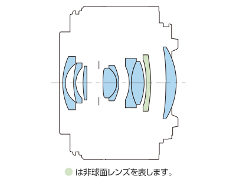

# 📷 RF16mm F2.8 STM

*Detailed specifications and optical analysis*

---

## 📊 **Lens Overview**

### 🔍 **Basic Information**
- **Name**: RF16mm F2.8 STM
- **Mount**: RF
- **MTF Chart**: ✅ Available
- **Construction**: ✅ Available
- **Specification Images**: 5 images

### 🌐 **Source Information**
- **Canon Japan URL**: [View Official Page](https://personal.canon.jp/product/camera/rf/rf16-f28/spec)
- **Data Collection**: Automated web scraping
- **Last Updated**: January 2025

---

## 🔧 **Technical Specifications**

### 📏 **Specifications**
*Specifications will be added when metadata is available*

---

## 📊 **Optical Performance**

### 📈 **MTF Chart Analysis**

- **MTF Chart**: Available for detailed analysis
- **Resolution**: High-resolution PNG format
- **Analysis**: Shows optical performance at different apertures
- **Comparison**: Can be compared with other lenses

### 🔍 **Lens Construction**

- **Construction Diagram**: Available showing optical elements
- **Element Layout**: Visual representation of lens groups
- **Optical Design**: Shows lens element arrangement
- **Engineering**: Illustrates optical complexity

---

## 🎯 **Lens Classification**

### 📝 **Category Analysis**
- **Lens Type**: Prime Lens
- **Focal Length**: 16mm (Prime)
- **Maximum Aperture**: f/16.0 (Constant)
- **Features**: Stepper Motor

---

## 📱 **Quick Actions**

### 🔧 **Tools & Viewers**
- **[📊 View in Enhanced Viewer](../../canon_enhanced_mtf_viewer.html)** - Interactive browser
- **[📈 Compare with Other Lenses](../../analysis/mtf_comparison.md)** - Side-by-side analysis
- **[🔍 Find Similar Lenses](../../lens_finder.md)** - Recommendation engine

### 📂 **Related Content**
- **[🔵 All RF Lenses](../rf_lenses.md)** - Browse RF collection
- **[🔴 All EF Lenses](../ef_lenses.md)** - Browse EF collection
- **[📊 Collection Statistics](../statistics.md)** - Overall analysis

---

## 🌐 **Additional Information**

### 📚 **Learn More**
- **[Understanding MTF Charts](../education/understanding_mtf.md)** - Technical explanation
- **[Lens Construction Guide](../education/lens_construction.md)** - Optical principles
- **[Choosing the Right Lens](../education/lens_selection.md)** - Selection advice

### 🔗 **External Resources**
- **[Canon Japan Product Page](https://personal.canon.jp/product/camera/rf/rf16-f28/spec)** - Official specifications
- **[Canon Global Lens Museum](https://global.canon/en/c-museum/lens.html)** - Historical context

---

*[← Back to Index](../../index.md) | [← Back to Mount Type](../rf_lenses.md)*
